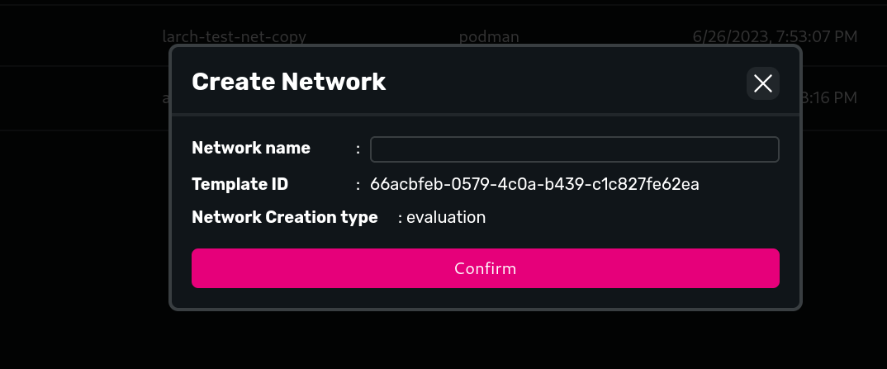
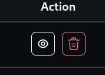

# Zombienet Network

Zombienet Network can be created from the Network templates, the network can be created for either evaluation or testing purposes

While creating a network for either evaluation or network testing purposes, name of the network should be given and confirm to started the network orchestration.

On confirm it will take to network listing page, there one can delete (dustbin icon) or view the execution info (eye icon) like logs and zombienet command

## Executions

- On clicking execution info button it will take to execution listing page with network name filter applied.
  - to view command click on Command button
  - to view Output of the Zombienet invocation click on Output button
    - In output you can view standard output and error logs
    - There is auto scroll functionality to scroll as logs are being generated