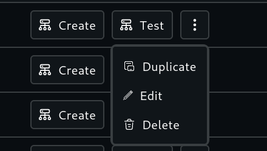

# Zombienet Network Template

Network template is a set of network configurations which will be utilized during the network creation using Zombienet.

## Template List and features

Following operations can be performed on a template:

- **Create**
  - Create the network for evaluations based on the template record
- **Test**
  - Create the network for testing based on the template record and test file configured during template creation and update.
- **Duplicate**
  - Duplicate the template with exact configurations as the current selected template with a option to name the new template.
- **Edit**
  - Edit the template, opens similar interface of template creation.
- **Delete**
  - Delete the template, deleting the template does not affect the network created using the template being deleted.

## Template create

Template can be created by clicking `Network Template +` button at the top of the page

Template creation will feel similar to Zombienet config sections, it contains following sections

- Settings
  - This section is to set the template name, provider and other Zombienet features
- Relaychain Configuration
  - User can set default features and arguments and add nodes as required
- Parachain Configuration
  - user can add parachains with their parachain information
- HRMP Channels
  - User can add multiple HRPM channels as required
- Test Configuration
  - The test configuration has to be filled manually based on the `zndsl` format, currently there is no error checking so user has to recheck manually.
  - Network and Description will be prefilled, of which description can editable but network is not.

User and select any section by clicking section heading and finally save at the last section (Test Configuration page).

## References:

[1]: [Network definition spec - 🧟🧟🧟 ZombieNet 🧟🧟🧟](https://paritytech.github.io/zombienet/network-definition-spec.html)