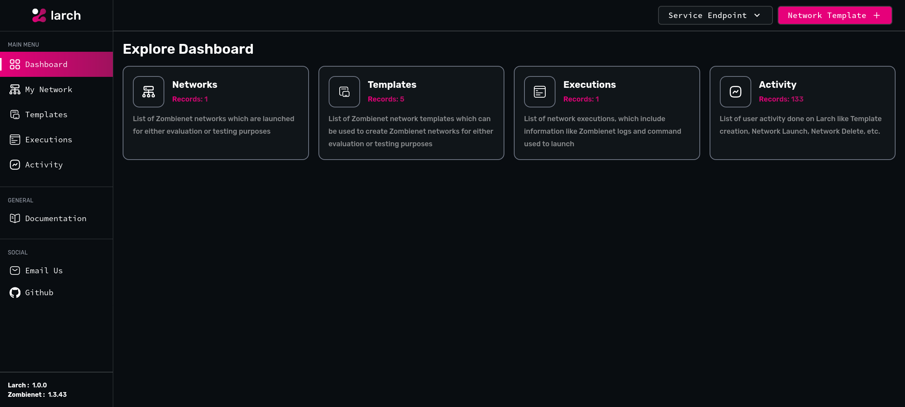

#  Larch

A GUI for Substrate / Polkadot Zombienet application



## Usage

### Prerequisites

- Install the required Provider so that network orchestrated by Larch and Zombienet
- If running the from source, NodeJS v18 or higher is required

### Steps

- Execute following commands to start Larch from **source**
  - `npm i`
  - `npm run build`
  - `npm run start`

- Execute following commands to start Larch from **executable** (download from [releases](https://github.com/Zeeve-App/larch/releases))
  - `./larch`

- Application will be started on Port 9000 (Default), to view UI then go the browser and navigate to `http://localhost:9000`.
- Create the network template and then launch the network using the created template.
- Zombienet will be downloaded by Larch if the supported version binary is not present in the `~/.larch/bin`,
  once downloaded it will start creating the network 

### Help

- `npm run start -- --help` or `./larch --help`

```
Welcome to Larch
Usage: larch [options]

GUI Application for managing Zombienet

Options:
  -V, --version          output the version number
  --disable-ui           Disable Frontend
  --disable-api          Disable Backend
  --service-port <port>  Larch service HTTP listen port (default: "9000")
  -h, --help             display help for command
```

## Additional information

### Docs

- [Docs](/docs/index.md)
- [Tutorial](/docs/user/tutorial.md)

## License

- Larch application source is licensed under GNU GPLv3 [license](./license)

## References:

- [paritytech/zombienet: A cli tool to easily spawn ephemeral Polkadot/Substrate networks and perform tests against them.](https://github.com/paritytech/zombienet)
